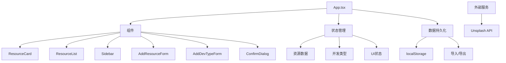
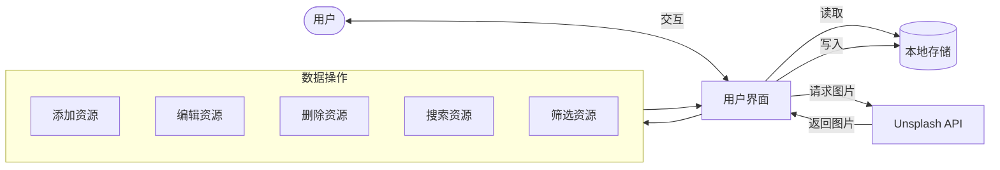
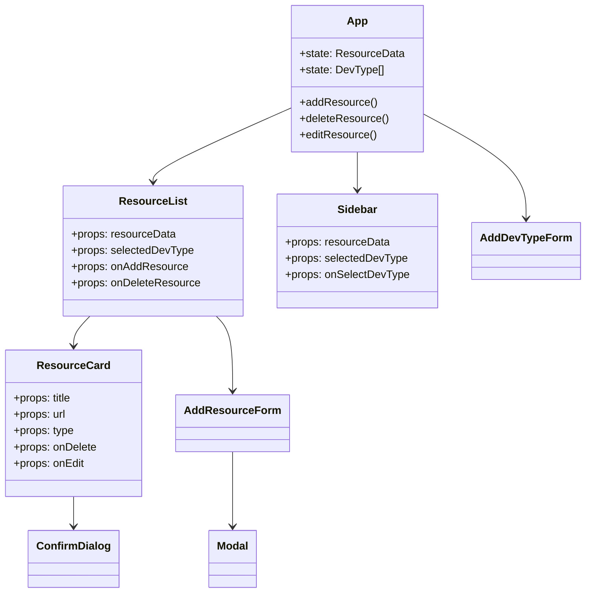
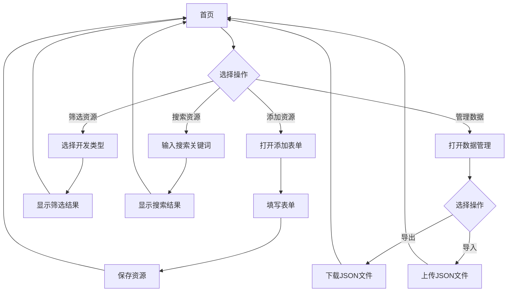

# 个人资源网址收纳库 📚

一个现代化的Web应用，用于收集和管理各类开发资源链接。

<div align="center">
  
  
  
  
</div>

## 功能特点 ✨

- 🗂️ 支持多种开发类型分类（前端、后端、小程序等）
- 🏷️ 支持多种资源类型分类（图标、图片素材、开发规则等）
- 💾 本地存储保存数据，无需后端服务
- 🎨 使用FontAwesome图标和Unsplash图片资源
- 📱 响应式设计，适配各种设备
- 🌈 优雅的动画效果和交互体验
- 🔄 资源卡片支持编辑、删除、复制链接和访问链接功能
- ➕ 支持自定义开发类型和资源类型
- 📤 数据导入/导出功能，方便备份和迁移
- 🔍 搜索功能，快速查找资源
- 👆 长按删除类型功能
- 💧 按钮点击涟漪效果
- 🌫️ 卡片删除淡出动画
- 📜 自定义滚动条样式
- 🎭 主题设置功能

## 应用架构 🏗️



## 数据流 🔄



## 技术栈 🛠️

- ⚛️ React 18
- 📘 TypeScript
- ⚡ Vite
- 🎨 Tailwind CSS
- 🔣 FontAwesome 图标
- 🖼️ Unsplash 图片API

## 开发指南 🚀

### 配置 Unsplash API

1. 访问 [Unsplash Developers](https://unsplash.com/developers) 注册开发者账号
2. 创建一个新的应用，获取 Access Key
3. 复制 `.env.example` 文件并重命名为 `.env`
4. 将您的 Unsplash Access Key 填入 `.env` 文件中：
   ```
   VITE_UNSPLASH_ACCESS_KEY=your_unsplash_access_key_here
   ```

### 安装依赖

```bash
npm install
```

### 启动开发服务器

```bash
npm run dev
```

### 构建生产版本

```bash
npm run build
```

### 预览生产版本

```bash
npm run preview
```

## 项目结构 📁

```
src/
├── components/       # 组件目录
│   ├── ResourceCard.tsx     # 资源卡片组件
│   ├── AddResourceForm.tsx  # 添加资源表单
│   ├── ConfirmDialog.tsx    # 确认对话框
│   ├── AddDevTypeForm.tsx   # 添加类型表单
│   ├── ResourceList.tsx     # 资源列表组件
│   ├── Sidebar.tsx          # 侧边栏组件
│   └── Modal.tsx            # 模态框组件
├── types/           # TypeScript 类型定义
├── utils/           # 工具函数
│   └── unsplash.ts     # Unsplash API 集成
├── config.ts        # 配置文件
├── index.css        # 全局样式
└── App.tsx          # 主应用组件
```

### 组件关系图 🔄



### 核心组件说明 🧩

#### App.tsx
- 🧠 应用的主入口，负责状态管理和数据持久化
- 🔔 管理全局对话框和通知系统
- 💾 处理数据导入/导出功能
- 🎨 实现主题设置

#### ResourceCard.tsx
- 🃏 展示单个资源的卡片组件
- 🔄 支持删除、编辑、复制链接和访问链接功能
- ✨ 包含优雅的动画效果（如删除时的淡出动画）

#### AddResourceForm.tsx
- ➕ 添加新资源的表单组件
- 📋 支持选择开发类型和资源类型
- 🔍 自动从 URL 提取标题

#### ResourceList.tsx
- 📑 展示资源列表，按开发类型和资源类型分组
- 🔍 支持搜索功能
- 📱 响应式布局，适应不同屏幕尺寸

#### Sidebar.tsx
- 📌 侧边栏导航组件
- 📏 可折叠设计，节省空间
- 🔢 显示每种类型的资源数量

## 数据结构 📊

项目使用以下主要数据结构：

```typescript
// 资源数据结构
interface ResourceData {
  [devType: string]: {
    [resourceType: string]: ResourceItem[];
  };
}

// 资源项
interface ResourceItem {
  title: string;
  url: string;
  type: string;
  addedAt: string;
}

// 开发类型
interface DevTypeInfo {
  id: string;
  name: string;
  icon: string;
  resourceTypes: ResourceType[];
}

// 资源类型
interface ResourceType {
  id: string;
  name: string;
  icon: string;
}
```

## 样式和动画 💫

项目使用 Tailwind CSS 进行样式设计，并定义了丰富的自定义动画：

- 🔄 对话框进入/退出动画
- 🌊 内容切换动画
- 📝 列表项动画
- 📌 标题动画
- 🎈 浮动动画
- 🔔 通知动画
- 🌫️ 资源卡片删除动画
- 💧 按钮点击涟漪效果

## 性能优化 ⚡

- 🖼️ **图片优化**：Unsplash 图片缓存机制和备用图片服务
- 🚀 **动画性能**：使用 `will-change` 属性和硬件加速
- ⚙️ **渲染优化**：条件渲染和列表项的键优化

## 使用说明 📖

1. 点击"添加"按钮创建新的资源链接
2. 选择开发类型和资源类型
3. 输入资源URL和标题
4. 点击"保存资源"按钮保存
5. 使用左侧边栏筛选不同开发类型的资源
6. 使用搜索框搜索特定资源
7. 长按左侧栏的类型可以删除自定义类型
8. 点击右上角的数据管理按钮可以导入/导出数据
9. 点击资源卡片可以编辑资源信息
10. 鼠标悬停在资源卡片上可以看到操作按钮（访问链接、复制链接、删除）

## 用户界面流程 🔄



## 自定义开发类型 🛠️

1. 点击左侧栏底部的"添加类型"按钮
2. 输入类型名称
3. 选择图标
4. 选择是否使用默认资源类型或添加自定义资源类型
5. 点击"确认添加"按钮保存

## 数据导入/导出 💾

1. 点击右上角的数据管理按钮
2. 选择"导出数据"将当前数据导出为JSON文件
3. 选择"导入数据"从JSON文件导入数据
4. 导入时可以选择合并或替换现有数据

## 注意事项 ⚠️

- 请确保在使用前配置好 Unsplash API Access Key
- 如果没有配置 Unsplash API，将使用备用图片服务
- 遵循 Unsplash API 的使用条款和限制
- 所有数据存储在浏览器的 localStorage 中，清除浏览器数据会导致数据丢失
- 建议定期导出数据进行备份

## 推荐图标 🎨

为了美化您的应用，以下是一些推荐的图标资源：

- [Favicon.io](https://favicon.io/) - 快速生成网站图标
- [Flaticon](https://www.flaticon.com/) - 免费矢量图标
- [Iconify](https://iconify.design/) - 开源图标集合
- [Heroicons](https://heroicons.com/) - 由Tailwind CSS团队设计的图标
- [Phosphor Icons](https://phosphoricons.com/) - 灵活的图标集

## 联系与反馈 📬

- GitHub: [https://github.com/vag-Zhao](https://github.com/vag-Zhao)
- 反馈问题: [zgs3344521@gmail.com](mailto:zgs3344521@gmail.com)

## 许可证 📄

MIT
